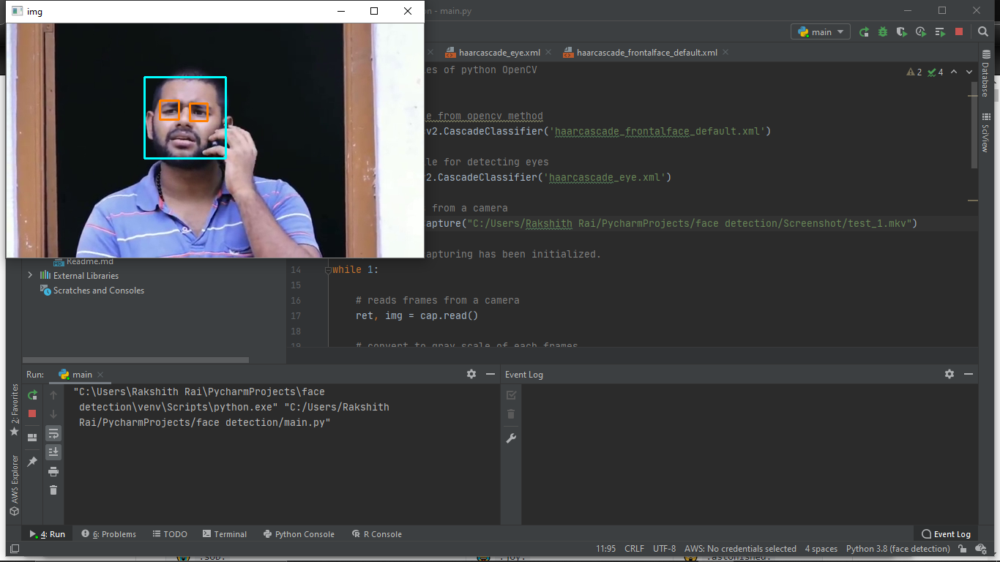
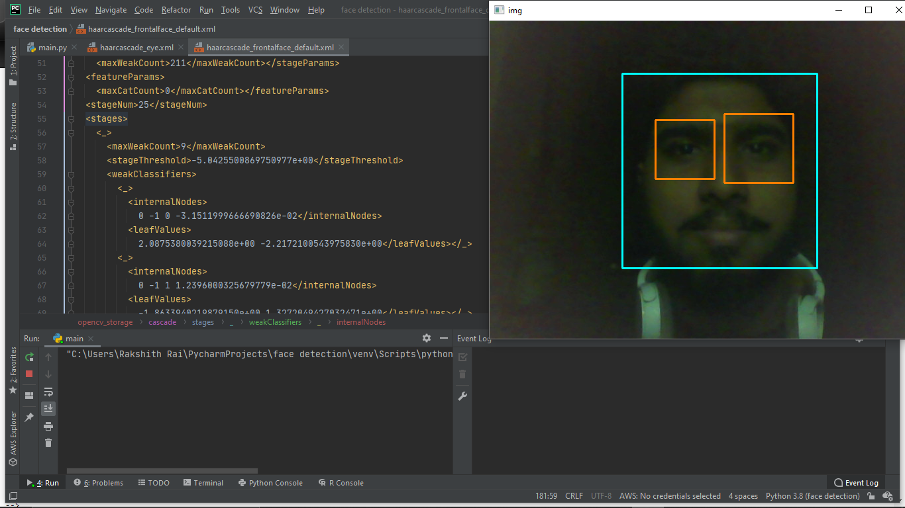

 Face_Detection
---

This is a Basic face detection code. this code will take the video stream from your computer and Detects face and Eyes using **OpenCV-Python**.


Xml file is not trained by me. these files are given in github a/c of OpenCV .

Its a fun Hobby project , tried out of interest and curiosity. this was a good project to understand a little more into face detection concept well if you want to use this code you can use Enjoy 

>Camera

In line 11 on main.py replace below code
```python
# capture frames from a camera
cap = cv2.VideoCapture(0)
```
>Video

want to use a video then replace absolute_address with file address
```python
# capture frames from a camera
cap = cv2.VideoCapture("absolute_address")
```

--- 
**Files needed for this to work** :relaxed:
>[haarcascade_frontalface_default](https://github.com/Itseez/opencv/blob/master/data/haarcascades/haarcascade_frontalface_default.xml)

>[haarcascade_eye](https://github.com/Itseez/opencv/blob/master/data/haarcascades/haarcascade_eye.xml)

---
if you want to install opencv the use this cmd

`pip install opencv-python `

this will install opencv then run the code by using

`python main.py`

or

`python3 main.py`

Enjoy coding :blush:

>screen shots of project 
 
 Used short video from [YouTube](https://youtu.be/CQhxHr2-XSc)

>Live Camera




